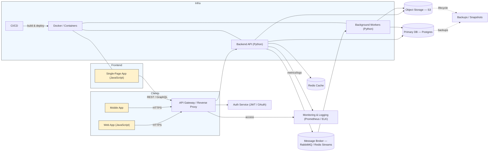

# Architecture overview

This document provides a high-level architecture overview for the DietFlow project. It shows core components (frontend, backend, workers), data stores, and infrastructure components. Use this as a starting point and adjust specific services and names to match the actual implementation.

## Legend
- Web App / Mobile: JavaScript clients (SPA, PWA, or native wrappers)
- API Gateway: reverse proxy or API gateway (NGINX / Traefik)
- Backend API: Python service(s) exposing REST or GraphQL endpoints
- Background Workers: Python processes handling async jobs
- DB / Cache / Storage: typical persistence and caching layers
- Docker: services run in containers; CI/CD builds and deploys images

Adjust component names and technologies to match the repository's actual services and deployment model.